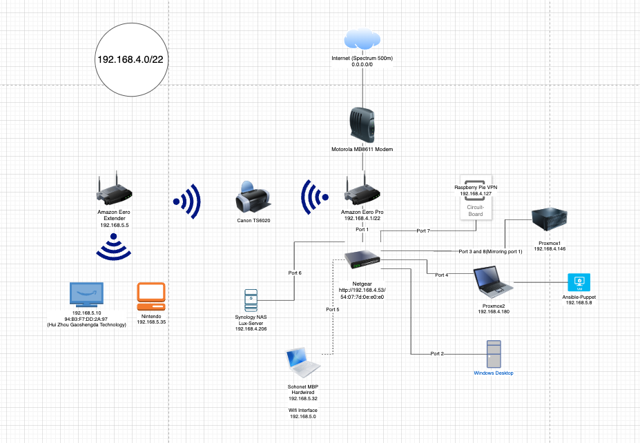
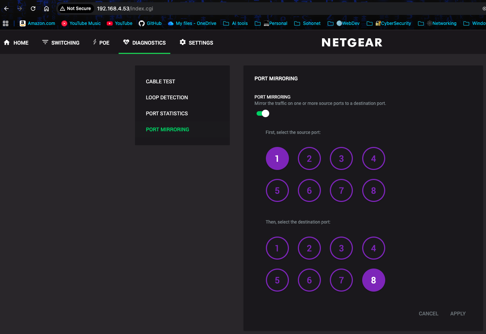
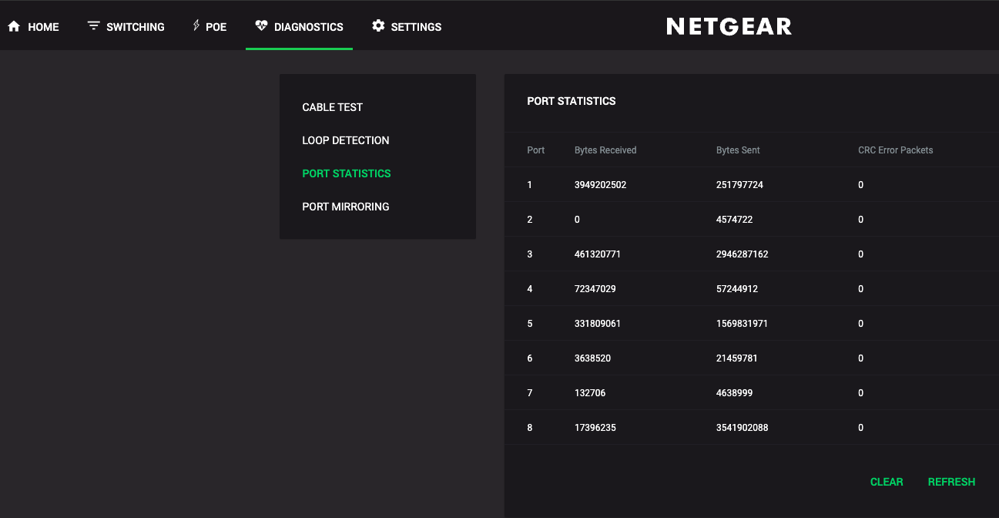
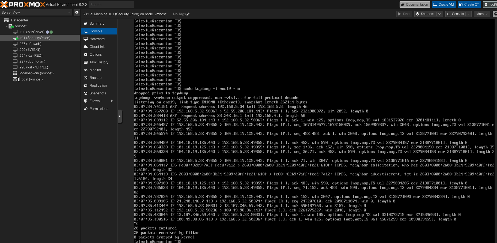
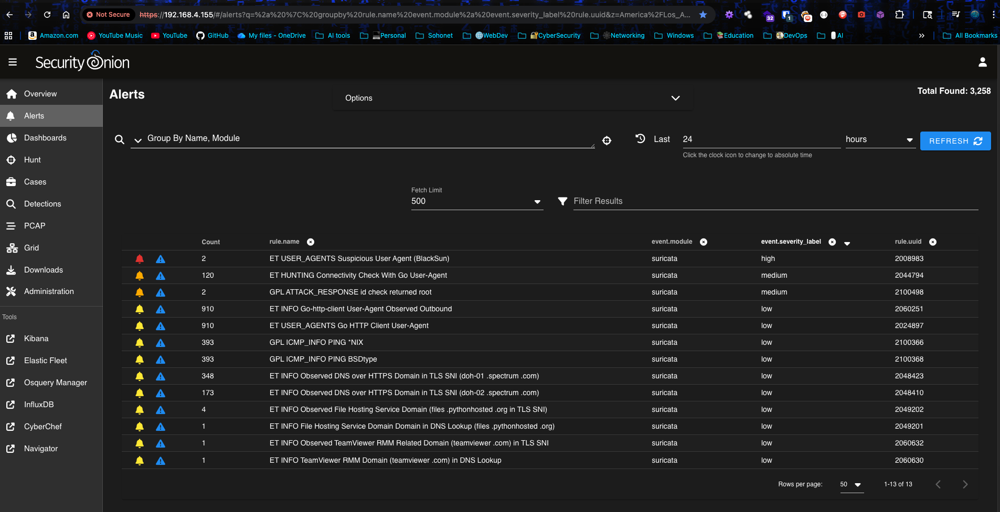

# Security Onion 2.4.90-2 Lab Setup on Proxmox
## Enterprise IDS/NSM Deployment Guide

**Author:** Alex Lux  
**Date:** December 2024  
**Environment:** Home Lab - Proxmox VE on Intel NUC

---

## Table of Contents
1. [Project Overview](#project-overview)
2. [Hardware Requirements](#hardware-requirements)
3. [Network Architecture](#network-architecture)
4. [Proxmox VM Configuration](#proxmox-vm-configuration)
5. [Proxmox Host Network Setup](#proxmox-host-network-setup)
6. [Security Onion Installation](#security-onion-installation)
7. [Network Interface Configuration](#network-interface-configuration)
8. [Troubleshooting Guide](#troubleshooting-guide)
9. [Verification & Testing](#verification--testing)
10. [Maintenance & Operations](#maintenance--operations)
11. [Appendix: Complete Configuration Files](#appendix-complete-configuration-files)

---

## Project Overview

### Objective
Deploy a full-packet capture and Intrusion Detection System (IDS) using Security Onion 2.4.90-2 running as a VM on Proxmox. The system will passively monitor all network traffic entering and leaving the home network without disrupting connectivity.

### Why Security Onion 2.4?
Security Onion 2.4 utilizes the Elastic Stack (Elasticsearch, Logstash, Kibana) for log aggregation and analysis. It includes:
- **Suricata**: Intrusion Detection System (IDS)
- **Zeek**: Network Security Monitor (NSM)
- **Stenographer**: Full packet capture (PCAP)
- **Kibana**: Log visualization and analysis

### Architecture Summary
```
Internet → Eero Router (Port 1) → Netgear Switch → Devices
                              ↓
                    [Port Mirror] → Port 8 → Proxmox (enp2s0) → vmbr1 → Security Onion VM
```

---

## Hardware Requirements

### Minimum Specifications (Evaluation Mode)
| Resource | Minimum | Recommended |
|----------|---------|-------------|
| **RAM** | 16 GB | 32-64 GB |
| **CPU** | 4 Cores | 8-16 Cores |
| **Storage** | 200 GB SSD | 500 GB - 2 TB SSD |
| **NICs** | 2 Interfaces | 2 Interfaces |

**Critical Notes:**
- **RAM**: 12GB is the absolute floor. Less will cause installer crashes or service failures.
- **Storage**: Must be SSD/NVMe. Mechanical HDDs cannot handle Elasticsearch indexing speeds.
- **CPU Type**: Must be set to "Host" in Proxmox (not kvm64) to support required instruction sets (AVX).

### Our Lab Configuration
- **Host**: Intel NUC Mini PC (Proxmox VE 8.x)
- **VM RAM**: 16 GB (Evaluation mode)
- **VM CPU**: 4 Cores, Type: Host
- **VM Storage**: 200 GB (SSD)
- **Network**: 2 Interfaces (Management + Sniffing)

---

## Network Architecture

### Physical Setup



*This diagram shows the complete network topology including the Internet connection, Eero Pro router, Netgear switch with port mirroring configuration, Proxmox hosts, and all connected devices. Note the "Port 3 and 8 (Mirroring port 1)" connection to Proxmox1, which is critical for Security Onion traffic capture.*

**Components:**
1. **Eero Pro Router** (192.168.4.1) - Connected to Netgear Switch Port 1
2. **Netgear GS308EPP Managed Switch** (192.168.4.53)
   - Port 1: Eero Router (Source for mirroring)
   - Port 8: Proxmox Sniffer Interface (Destination for mirroring)
3. **Proxmox Host** (192.168.4.146)
   - **eno2**: Management interface (vmbr0) - Standard LAN access
   - **enp2s0**: Sniffing interface (vmbr1) - Receives mirrored traffic

### Network Flow
1. All internet traffic passes through Port 1 (Eero Router)
2. Netgear switch mirrors all Port 1 traffic to Port 8
3. Proxmox receives mirrored traffic on enp2s0
4. Traffic is forwarded to Security Onion VM via vmbr1 bridge
5. Security Onion analyzes traffic without disrupting network flow

---

## Proxmox VM Configuration

### Step 1: Create Virtual Machine

1. **Download Security Onion ISO**
   - Download `SecurityOnion-2.4.90-2.iso` from [securityonion.net](https://securityonion.net)

2. **Create New VM in Proxmox**
   - Click "Create VM"
   - **Name**: SecurityOnion (or seconion)
   - **OS Type**: Linux 5.x/2.6 Kernel

### Step 2: Configure Hardware Resources

**Critical Settings in Proxmox VM Creation Wizard:**

**Memory Tab:**
- **Memory**: 16384 MiB (16 GB) - **DO NOT use less than 16GB**
- **Minimum Memory**: 16384 MiB (set to same as Memory)
- **Ballooning Device**: **UNCHECKED** (Critical! Elasticsearch requires fixed memory allocation)

**CPU Tab:**
- **Cores**: 4
- **CPU Type**: **Host** (NOT kvm64 - required for AVX instructions)
  - This is in: Hardware > Processors > Type
  - Select "Host" from the dropdown

**Hard Disk Tab:**
- **Storage**: 200 GB (SSD recommended)
- **Disk Controller**: VirtIO SCSI
- **Cache**: Write Back (unsafe) or Default

**Visual Guide:** In the Proxmox web interface, navigate through the VM creation wizard and ensure these settings match exactly. The memory setting is the most critical - if you see 2048 MiB (2 GB), increase it to 16384 MiB immediately.

**Why "Host" CPU Type?**
If left as kvm64 (default), services like Elasticsearch or Suricata may fail with "Illegal Instruction" errors. The Host type exposes modern CPU instruction sets (like AVX) required by Security Onion.

**Visual Guide:** In Proxmox, go to Hardware > Processors > Type dropdown. Change from "kvm64" (default) to "Host". This setting is critical for Security Onion services to start properly.

### Step 3: Configure Network Interfaces

#### First Interface (Management - net0)

**In the Proxmox VM Creation Wizard > Network Tab:**

**Initial Setup:**
- **Bridge**: vmbr0 (Your standard management bridge)
  - Select from the dropdown - this should be your existing bridge with internet access
- **Firewall**: Checked (Default - leave this checked)
- **Model**: VirtIO (paravirtualized - default is fine)

**Visual Guide:** You'll see a network configuration screen during VM creation. Make sure you select vmbr0 (not vmbr1 or vmbr-mirror) for the first interface. This interface will get an IP address via DHCP or static assignment.

**Why vmbr0?** The first interface needs an IP address and internet access for:
- Running the installer
- Downloading updates
- Web console access

**DO NOT** select the mirror bridge here - the installer will fail without network access.

#### Second Interface (Sniffing - net1)

**Add After VM Creation:**
1. Shutdown the VM completely
2. Go to **Hardware** > **Add** > **Network Device**
3. Configure:
   - **Bridge**: vmbr1 (or vmbr-mirror - we'll create this next)
   - **Firewall**: **UNCHECKED** (Critical! Do not filter sniffing traffic)
   - **Model**: Intel E1000 (We'll change this from VirtIO later)

**Visual Guide:** After VM creation, go to Hardware tab > Add > Network Device. You'll see a similar network configuration dialog. Configure it with:
- Bridge: vmbr1
- Firewall: **UNCHECKED** (Critical!)
- Model: Intel E1000

**Why Intel E1000?** The VirtIO driver locks checksum settings (`[fixed]` error). Intel E1000 allows full control to disable offloading.

---

## Proxmox Host Network Setup

### Step 1: Identify Physical Interfaces

On your Proxmox host, identify which physical ports correspond to which interfaces:

```bash
ip -br link show
```

Look for interfaces like:
- `eno2` - Usually management
- `enp2s0` - Usually the second port
- `eth0`, `eth1` - Older naming convention

**Verification Test:**
```bash
# List all interfaces
ip -br link show

# Unplug a cable and run again
# The interface that changes from UP to DOWN is your physical port
```

### Step 2: Configure /etc/network/interfaces

Edit the Proxmox host network configuration:

```bash
nano /etc/network/interfaces
```

**Complete Configuration:**

```bash
auto lo
iface lo inet loopback

# Management Interface (eno2)
iface eno2 inet manual

# Management Bridge (vmbr0)
# Connects to your standard LAN/Internet
auto vmbr0
iface vmbr0 inet static
    address 192.168.4.146/22
    gateway 192.168.4.1
    bridge-ports eno2
    bridge-stp off
    bridge-fd 0

# Physical Interface for Sniffing (enp2s0)
# Connects to Netgear Port 8
auto enp2s0
iface enp2s0 inet manual
    up ip link set dev enp2s0 up

# Sniffing Bridge (vmbr1)
# This passes traffic from enp2s0 to the VM
auto vmbr1
iface vmbr1 inet manual
    bridge-ports enp2s0
    bridge-stp off
    bridge-fd 0
    bridge-ageing 0                    # CRITICAL: Hub mode (floods all traffic)
    # Enable Promiscuous mode so the VM sees the traffic
    up ip link set dev enp2s0 promisc on
    up ip link set dev vmbr1 promisc on
    # DISABLE OFFLOADING (The Fix for Suricata)
    # We force it off on the physical port AND the bridge
    post-up ethtool -K enp2s0 rx off tx off sg off tso off ufo off gso off gro off lro off
    post-up ethtool -K vmbr1 rx off tx off sg off tso off ufo off gso off gro off lro off

# Wireless interface (if applicable)
auto wlo1
iface wlo1 inet manual

source /etc/network/interfaces.d/*
```

**Key Configuration Points:**

1. **bridge-ageing 0**: Forces the bridge into "Hub Mode" - floods all packets to the VM instead of filtering by MAC address. **This is critical!**

2. **Promiscuous Mode**: Allows the interface to see all traffic, not just traffic destined for it.

3. **Offloading Disabled**: Prevents the network card from modifying packet checksums, which would corrupt data for IDS analysis.

### Step 3: Apply Network Configuration

```bash
# Reload network configuration
ifreload -a

# If that fails or hangs, reboot the host
reboot
```

**After Reboot, Verify:**
```bash
# Check bridge status
ip -br link show | grep vmbr

# Verify promiscuous mode
ip link show vmbr1 | grep PROMISC

# Verify offloading is disabled
ethtool -k enp2s0 | grep -E "rx-checksumming|tx-checksumming"
```

---

## Security Onion Installation

### Step 1: Boot from ISO

1. Attach the Security Onion ISO to the VM
2. Boot the VM
3. Select "Install Security Onion" from the boot menu

### Step 2: Installation Wizard

The installer will guide you through:

1. **Keyboard Layout**: Select your preference
2. **Network Configuration**: 
   - **Management Interface**: Select `ens18` (or the interface with an IP address)
     - The installer will show available interfaces
     - Look for the one that has a MAC address matching your Proxmox net0 interface
     - This interface will get an IP address
   - **Monitor Interface**: Will be configured later (select `ens19` or the second interface)

**Visual Guide:** The Security Onion installer will display a list of network interfaces. Each will show:
- Interface name (e.g., ens18, ens19)
- MAC address
- Link status (UP/DOWN)
- IP address (if assigned)

Select the interface that matches your Proxmox management bridge (vmbr0) for the Management Interface.

3. **Node Type Selection**: 
   - **EVAL** (Evaluation Mode) - For 16GB RAM
     - Select this option if you allocated 16GB RAM
     - Provides all features with reduced memory footprint
   - **STANDALONE** - Requires 32GB+ RAM
     - Only select if you have 32GB+ allocated
     - Will crash on 16GB systems

**Visual Guide:** The installer will show a menu with options:
```
[ ] EVAL (Evaluation mode)
[ ] STANDALONE (Production mode)
```

Use arrow keys to select EVAL and press Enter. The installer will warn you if you try STANDALONE with insufficient RAM.

**Why EVAL?** STANDALONE is tuned for enterprise workloads expecting 32-64GB RAM. EVAL installs the same tools but uses less memory.

4. **Network Configuration**:
   - **IP Address**: 192.168.4.155 (or your preferred static IP)
   - **Subnet**: /22 (matches your network - **critical!**)
     - This must match your Proxmox host subnet (192.168.4.146/22)
     - Using /24 will prevent communication with other devices
   - **Gateway**: 192.168.4.1
   - **DNS**: 192.168.4.1 (or your preferred DNS)

**Visual Guide:** The installer will show a network configuration screen with fields:
- IP Address: Enter your static IP
- Subnet Mask or CIDR: Enter /22 (or 255.255.252.0)
- Gateway: Enter your router IP
- DNS: Enter DNS server IP

**Critical:** The subnet /22 is essential - if you leave it at the default /24, the VM won't be able to communicate with devices on other subnets (like 192.168.5.x).

5. **User Account**: Create your admin account
   - Username: `alexlux@live.com` (or your email)
   - Password: (Set a strong password)

6. **Installation**: Wait 20-40 minutes for installation to complete

### Step 3: Post-Installation Configuration

After installation, log into the Security Onion console and configure the monitor interface:

```bash
# Add the sniffing interface
sudo so-monitor-add ens19
```

**Note:** If `ens19` doesn't exist (interface name changed after switching to Intel E1000), find the correct name:

```bash
# List all interfaces
ls /sys/class/net

# Or use ip command
ip link show
```

The monitor interface will be the one without an IP address (usually `eth1` or `ens33` if you changed the NIC model).

---

## Network Interface Configuration

### Step 1: Configure Netgear Switch Port Mirroring

1. **Access Switch Web Interface**
   - Navigate to `http://192.168.4.53` (or your switch IP)
   - Login with admin credentials

2. **Configure Port Mirroring**
   - Navigate to **Monitoring** > **Mirroring** (or **Port Mirroring** depending on switch model)
   - **Source Port**: Select Port 1 (Eero Router)
   - **Destination Port**: Select Port 8 (Proxmox Sniffer)
   - **Direction**: Both (Tx + Rx) - This ensures you capture traffic in both directions
   - Click **Apply** or **Save**



*This screenshot shows the NETGEAR switch port mirroring configuration page. Port 1 is selected as the source (highlighted in purple), and Port 8 is selected as the destination (highlighted in purple). The toggle switch is ON, enabling port mirroring.*

**Why Port 1?** The Eero router is your gateway. Mirroring Port 1 captures all internet traffic (North/South traffic) entering and leaving your network.

### Step 2: Verify Port Mirroring

**Check Switch Statistics:**
- Navigate to **Statistics** or **Port Statistics** in the switch web interface
- **Port 1**: Should show high Rx/Tx traffic (receiving and transmitting data)
- **Port 8**: Should show high Tx (transmitted to Proxmox) but low Rx (passive interface, not sending data back)

**What to Look For:**
- Port 1 will have both Rx (Receive) and Tx (Transmit) counters incrementing
- Port 8 will have Tx counter incrementing (switch sending mirrored traffic) but Rx will remain low (sniffing interface is passive)
- If Port 8 shows zero Tx, the mirroring is not working - double-check the configuration



*This screenshot shows the NETGEAR switch port statistics. Notice Port 1 has high Bytes Received (3,949,202,502) and Bytes Sent (251,797,724), indicating active traffic. Port 8 shows high Bytes Sent (3,541,902,088) but relatively low Bytes Received (17,396,235), which is correct for a passive sniffing interface receiving mirrored traffic.*

**Understanding Switch Stats:**
- **Tx (Transmit)**: Switch sending packets OUT of the port
- **Rx (Receive)**: Switch receiving packets FROM the port
- Port 8 should have high Tx (receiving mirrored traffic) but low Rx (not sending data back)

---

## Troubleshooting Guide

This section documents all issues encountered during setup and their solutions.

### Issue 1: VM Won't Start - "Bridge does not exist"

**Error:**
```
bridge 'vmbr1' does not exist
kvm: -netdev type=tap,id=net1... failed with status 512
TASK ERROR: start failed: QEMU exited with code 1
```

**Cause:** The bridge `vmbr1` hasn't been created in `/etc/network/interfaces` yet.

**Solution:**
1. Create the bridge configuration in `/etc/network/interfaces` (see Proxmox Host Network Setup)
2. Apply configuration: `ifreload -a` or reboot
3. Verify bridge exists: `ip link show vmbr1`

### Issue 2: No Traffic in VM - Bridge Filtering

**Symptom:** 
- `tcpdump` on Proxmox host shows traffic
- `tcpdump` inside VM shows nothing
- Only seeing ARP/broadcast traffic

**Root Cause:** Linux bridge acts like a switch, filtering packets by MAC address. Since mirrored packets are destined for other devices, the bridge drops them.

**Diagnosis:**
```bash
# On Proxmox Host - Should see traffic
tcpdump -i enp2s0 -nn

# Inside VM - Was silent (before fix)
tcpdump -i ens19 -nn
```

**Solution:**
```bash
# On Proxmox Host - Force bridge into "Hub Mode"
brctl setageing vmbr1 0

# Alternative if brctl not available
ip link set dev vmbr1 type bridge ageing_time 0
```

**Make Permanent:** Add `bridge-ageing 0` to `vmbr1` section in `/etc/network/interfaces`

### Issue 3: No Alerts - Checksum Offloading

**Symptom:**
- Traffic is visible in Zeek logs
- Zero Suricata alerts
- `ethtool -k ens19` shows `rx-checksumming: on [fixed]`

**Root Cause:** Network card offloading checksum validation corrupts packets for IDS analysis. The `[fixed]` tag means the VirtIO driver locks the setting.

**Diagnosis:**
```bash
# Inside VM - Check checksum status
ethtool -k ens19 | grep checksum
# Output: rx-checksumming: on [fixed]  <-- BAD
```

**Solution:**

**Step 1:** Disable offloading on Proxmox host (already in interfaces file):
```bash
ethtool -K enp2s0 rx off tx off sg off tso off ufo off gso off gro off lro off
ethtool -K vmbr1 rx off tx off sg off tso off ufo off gso off gro off lro off
```

**Step 2:** Change VM NIC model from VirtIO to Intel E1000:
1. Shutdown VM
2. Hardware > Network Device (net1) > Edit
3. Change Model: **Intel E1000**
4. Boot VM

**Step 3:** Verify fix:
```bash
# Inside VM - Should now show "off" without [fixed]
ethtool -k ens19 | grep checksum
# Output: rx-checksumming: off  <-- GOOD
```

**Why Intel E1000?** The Intel driver allows full control over offloading settings, bypassing the VirtIO `[fixed]` lock.

### Issue 4: Firewall Blocking Traffic

**Symptom:** No traffic reaching VM despite correct bridge configuration.

**Root Cause:** Proxmox firewall on the sniffing interface drops unsolicited incoming traffic.

**Solution:**
1. Go to VM > Hardware > Network Device (net1)
2. **Uncheck "Firewall"** checkbox
3. Reboot VM

**Visual Guide:** In Proxmox, go to your VM > Hardware > Network Device (net1) > Edit. You'll see:
- Bridge: vmbr1 (should already be set)
- Firewall: [ ] Checkbox - **UNCHECK THIS**
- Model: Intel E1000 (should already be set)

**Why?** The sniffing interface is passive (never initiates connections). The firewall sees mirrored traffic as "unsolicited" and drops it.

### Issue 5: Interface Name Changed After NIC Model Change

**Symptom:** After switching from VirtIO to Intel E1000, `ens19` no longer exists.

**Cause:** Linux renames interfaces based on driver/hardware model.

**Solution:**
```bash
# Find the new interface name
ls /sys/class/net
# Or
ip link show

# Update Security Onion to use new name
sudo so-monitor-add <new_interface_name>
# Example: sudo so-monitor-add eth1
```

### Issue 6: Physical Cable Mismatch

**Symptom:** Zero packets on host interface despite switch showing traffic.

**Diagnosis:**
```bash
# Check interface status
ip -br link show

# Look for interface that is DOWN or NO-CARRIER
# enp2s0 should be UP if cable is connected
```

**Solution:**
1. Verify cable is plugged into correct port on NUC
2. Verify cable is plugged into Port 8 on switch
3. Swap cables between ports to test
4. Check switch port statistics - Port 8 should show high Tx

### Issue 7: No Rules Loaded / Stale Rules

**Symptom:** Traffic visible but no alerts, even after fixing checksums.

**Solution:**
```bash
# Force rule update
sudo so-rule-update

# Verify Suricata is running
sudo so-status

# Check if specific rule exists
grep "2100498" /etc/suricata/rules/all.rules
```

### Issue 8: Wrong HOME_NET Configuration

**Symptom:** Alerts only for some devices, not others.

**Cause:** Suricata only alerts on attacks targeting IPs in `HOME_NET`. If your network spans multiple subnets (e.g., 192.168.4.x and 192.168.5.x), both must be included.

**Solution:**
1. Security Onion Console > Administration > Configuration
2. Navigate to `suricata` > `vars` > `HOME_NET`
3. Ensure it includes your entire network range:
   - Example: `192.168.0.0/16` (covers both .4.x and .5.x)
   - Or: `[192.168.4.0/22,192.168.5.0/24]`

---

## Verification & Testing

### Step 1: Verify Traffic Flow

**Test 1: Host Level (Proxmox)**
```bash
# On Proxmox Host - Should see traffic scrolling
tcpdump -i enp2s0 -nn
```

**Expected:** Continuous stream of packets with IPs from your network (192.168.5.32, etc.)

**Test 2: VM Level (Security Onion)**
```bash
# Inside Security Onion VM
sudo tcpdump -i ens19 -nn
```

**Expected:** Same traffic visible (after applying bridge-ageing fix)



*This screenshot shows tcpdump running inside the Security Onion VM on the ens19 interface. The output shows captured network packets including ARP requests, TCP traffic, and IPv6 ICMP6 neighbor solicitations. The presence of traffic from various IPs (192.168.5.32, 52.55.206.184, etc.) confirms that port mirroring is working and the VM is successfully receiving mirrored traffic.*

### Step 2: Verify Interface Configuration

**Check Promiscuous Mode:**
```bash
# On Proxmox Host
ip link show vmbr1 | grep PROMISC
# Should show: PROMISC flag

# Inside VM
ip link show ens19 | grep PROMISC
# Should show: PROMISC flag
```

**Check Checksum Offloading:**
```bash
# Inside VM
ethtool -k ens19 | grep checksum
# Should show: rx-checksumming: off (without [fixed])
```

**Check Bridge Ageing:**
```bash
# On Proxmox Host
brctl showstp vmbr1 | grep ageing
# Or
cat /sys/class/net/vmbr1/bridge/ageing_time
# Should show: 0
```

### Step 3: Test Alert Generation

**Test 1: Simulated Attack (User-Agent)**
```bash
# From any device on your network (Windows PC, Mac, etc.)
curl -A "BlackSun" http://www.google.com
```

**Expected Alert:** `ET USER_AGENTS Suspicious User Agent (BlackSun)`

**Test 2: TestMyIDS.com**
```bash
# From any device on your network
curl http://testmyids.com
```

**Expected Alert:** `GPL ATTACK_RESPONSE id check returned root`

**Test 3: ICMP**
```bash
# From any device
ping 8.8.8.8
```

**Expected Alert:** `GPL ICMP_INFO PING`

### Step 4: Verify in Security Onion Console

1. **Access Web Console**: `https://192.168.4.155` (or your VM IP)
2. **Login**: Use credentials created during installation
3. **Check Alerts Tab**: Should see the test alerts above



*This screenshot shows the Security Onion alerts dashboard with 3,258 total alerts found. The table displays various security events including:*
- *`ET USER_AGENTS Suspicious User Agent (BlackSun)` - High severity (red bell icon)*
- *`GPL ATTACK_RESPONSE id check returned root` - Medium severity (orange bell icon)*
- *`GPL ICMP_INFO PING` alerts - Low severity (yellow bell icon)*
- *Various other network events and detections*

*The dashboard confirms your Security Onion installation is working correctly and actively detecting network threats. Notice the severity indicators (red for high, orange for medium, yellow for low) and the detailed rule information for each alert.*

4. **Check Grid Status**: All services should be green/running
   ```bash
   sudo so-status
   ```

5. **Check Hunt Tab**: Filter for `event.module: zeek` to see network logs

**Visual Guide:** In the Security Onion web console, navigate to the Hunt tab. You'll see:
- A search/filter bar at the top
- An Events table showing network connections
- Columns for: Timestamp, Source IP, Destination IP, Protocol, etc.
- Filter options on the left sidebar

To verify traffic, filter for `event.module: zeek` and look at the Source IP column. You should see IPs from your network devices (192.168.4.x, 192.168.5.x) not just the Security Onion VM itself.

**Verification Checklist:**
- [ ] Traffic visible in tcpdump (host and VM)
- [ ] Promiscuous mode enabled
- [ ] Checksum offloading disabled
- [ ] Bridge ageing set to 0
- [ ] Suricata alerts appearing
- [ ] Zeek logs showing network traffic
- [ ] Grid status shows all services running

---

## Maintenance & Operations

### Log Rotation & Disk Management

Security Onion automatically manages disk space:

- **Automatic Cleanup**: When disk usage reaches 90%, oldest logs (Elasticsearch indices) are automatically deleted
- **PCAP Rotation**: Old packet captures are rotated based on available space
- **No Manual Intervention Required**: The system is designed to run continuously without manual log deletion

**Monitor Disk Usage:**
```bash
# Check disk usage
df -h

# Check Elasticsearch indices
curl -X GET "localhost:9200/_cat/indices?v"
```

**With 200GB Allocation:**
- Typical home lab: 1-4 weeks of retention
- Depends on traffic volume and log verbosity

### Rule Updates

Keep detection signatures current:

```bash
# Update Security Onion (includes rules)
sudo soup

# Update rules only
sudo so-rule-update
```

**Recommended:** Run `sudo soup` weekly or monthly.

### Service Management

**Check Service Status:**
```bash
sudo so-status
```

**Restart Services:**
```bash
# Restart all services
sudo so-restart

# Restart specific service
sudo so-suricata-restart
sudo so-zeek-restart
```

**View Logs:**
```bash
# Suricata logs
sudo tail -f /var/log/suricata/suricata.log

# Zeek logs
sudo tail -f /var/log/zeek/current/conn.log
```

### VM Shutdown & Startup

**Safe Shutdown:**
- Use Proxmox UI: **Shutdown** (NOT Stop)
- Or from console: `sudo poweroff`

**Why Graceful Shutdown?** Prevents Elasticsearch database corruption.

**Startup:**
1. Start VM from Proxmox UI
2. Wait 3-5 minutes for services to initialize
3. Check status: `sudo so-status`
4. Access web console once all services are green

**Note:** While VM is off, you have no network monitoring. Internet connectivity remains unaffected.

### Network Configuration Persistence

**Critical:** After rebooting Proxmox host, verify:

1. **Bridge Ageing** is still 0:
   ```bash
   brctl showstp vmbr1 | grep ageing
   # Should show: 0
   ```

2. **Promiscuous Mode** is enabled:
   ```bash
   ip link show vmbr1 | grep PROMISC
   ```

3. **Offloading** is disabled:
   ```bash
   ethtool -k enp2s0 | grep -E "rx-checksumming|tx-checksumming"
   ```

If any are incorrect, the `/etc/network/interfaces` configuration should fix them automatically. If not, check the file and reload: `ifreload -a`

---

## Appendix: Complete Configuration Files

### Proxmox Host: /etc/network/interfaces

```bash
auto lo
iface lo inet loopback

# Management Interface (eno2)
iface eno2 inet manual

# Management Bridge (vmbr0)
# Connects to your standard LAN/Internet
auto vmbr0
iface vmbr0 inet static
    address 192.168.4.146/22
    gateway 192.168.4.1
    bridge-ports eno2
    bridge-stp off
    bridge-fd 0

# Physical Interface for Sniffing (enp2s0)
# Connects to Netgear Port 8
auto enp2s0
iface enp2s0 inet manual
    up ip link set dev enp2s0 up

# Sniffing Bridge (vmbr1)
# This passes traffic from enp2s0 to the VM
auto vmbr1
iface vmbr1 inet manual
    bridge-ports enp2s0
    bridge-stp off
    bridge-fd 0
    bridge-ageing 0                    # CRITICAL: Hub mode (floods all traffic)
    # Enable Promiscuous mode so the VM sees the traffic
    up ip link set dev enp2s0 promisc on
    up ip link set dev vmbr1 promisc on
    # DISABLE OFFLOADING (The Fix for Suricata)
    # We force it off on the physical port AND the bridge
    post-up ethtool -K enp2s0 rx off tx off sg off tso off ufo off gso off gro off lro off
    post-up ethtool -K vmbr1 rx off tx off sg off tso off ufo off gso off gro off lro off

# Wireless interface (if applicable)
auto wlo1
iface wlo1 inet manual

source /etc/network/interfaces.d/*
```

### Security Onion: Network Configuration

**Management Interface:** `ens18` (or first interface with IP)  
**Monitor Interface:** `ens19` (or second interface, no IP)

**Configuration Command:**
```bash
sudo so-monitor-add ens19
```

### Netgear Switch: Port Mirroring

**Source Port:** 1 (Eero Router)  
**Destination Port:** 8 (Proxmox Sniffer)  
**Direction:** Both (Tx + Rx)

---

## Key Takeaways

### Critical Success Factors

1. **Bridge Ageing = 0**: Without this, the bridge filters packets by MAC address, dropping mirrored traffic
2. **Checksum Offloading Disabled**: Required for accurate IDS analysis
3. **Intel E1000 NIC Model**: Bypasses VirtIO driver locks on checksum settings
4. **Firewall Disabled on Sniffing Interface**: Allows passive traffic to reach VM
5. **Promiscuous Mode**: Enables interface to see all traffic, not just destined traffic
6. **Port Mirroring Configured**: Switch must mirror source port to destination port

### Common Pitfalls

1. **Using kvm64 CPU Type**: Causes "Illegal Instruction" errors
2. **Ballooning Enabled**: Breaks Elasticsearch memory allocation
3. **Wrong Subnet Mask**: /24 instead of /22 prevents network communication
4. **Firewall on Sniffing Interface**: Drops all mirrored traffic
5. **Bridge Acting as Switch**: Filters packets instead of flooding to VM
6. **Checksum Offloading**: Corrupts packets for IDS analysis

### Performance Considerations

- **16GB RAM**: Minimum for EVAL mode, may struggle under heavy load
- **32GB+ RAM**: Recommended for production/standalone mode
- **SSD Storage**: Required for Elasticsearch performance
- **CPU Cores**: More cores = faster log indexing and analysis

---

## Conclusion

This lab successfully deployed Security Onion 2.4.90-2 as a VM on Proxmox, configured port mirroring on a managed switch, and resolved multiple networking challenges to achieve full network visibility. The system now passively monitors all network traffic and generates alerts for suspicious activity.

**Final Status:**
- ✅ Traffic capture operational
- ✅ Suricata generating alerts
- ✅ Zeek logging network connections
- ✅ Full packet capture enabled
- ✅ Web console accessible
- ✅ All services running

**Next Steps:**
- Explore Kibana dashboards for threat hunting
- Review and tune Suricata rules for your environment
- Set up alerting/notifications for critical events
- Document baseline network behavior
- Practice incident response workflows

---

**End of Lab Writeup**

